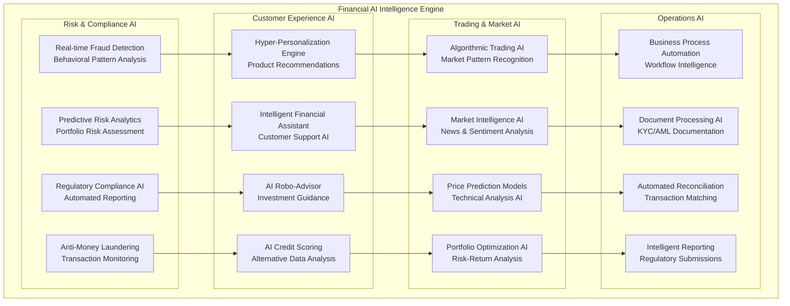
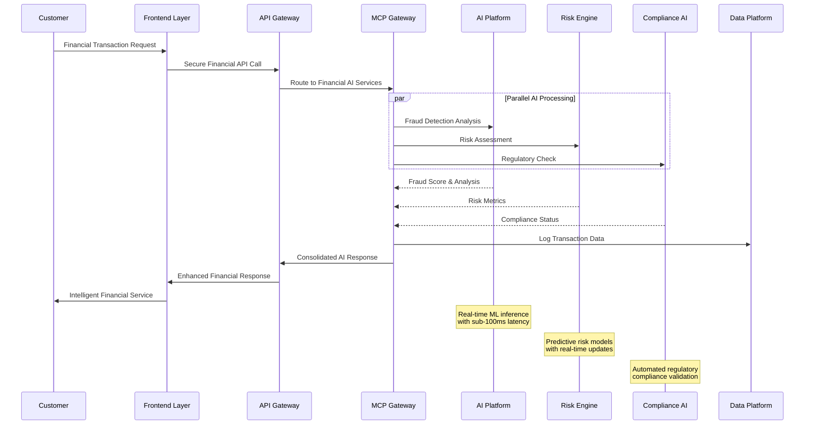
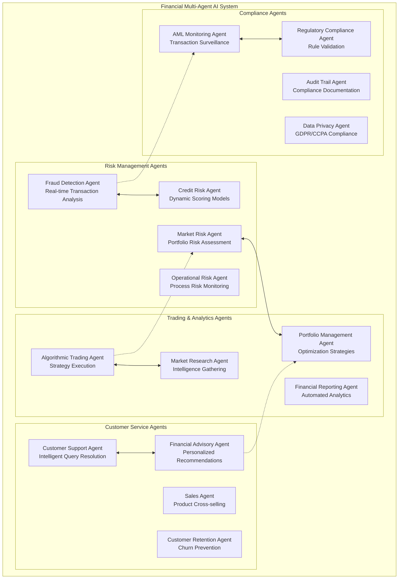
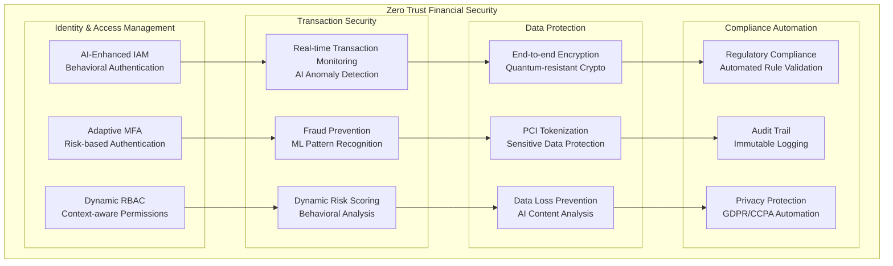
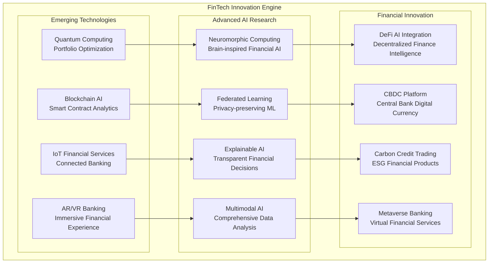
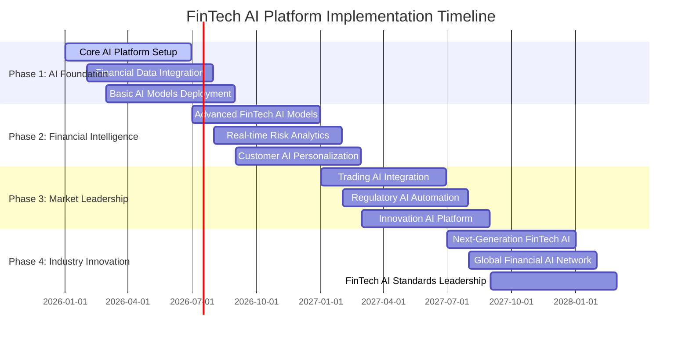

# AI Platform Enhanced Architecture for FinTech Evolution
## Comprehensive AI-Native Financial Technology Platform

---

## 🎯 Executive Summary

This document presents the **Enhanced AI Platform Architecture** specifically designed for **FinTech Evolution**, integrating our proven 13-layer enterprise architecture with cutting-edge AI capabilities to create the most advanced financial technology platform in the industry.

### **Strategic AI Platform Vision**
Transform financial services through an **AI-native platform** that delivers:
- **Intelligent Risk Management**: Real-time fraud detection and predictive risk analytics
- **Hyper-Personalization**: AI-driven customer experiences and product recommendations
- **Regulatory Excellence**: Automated compliance and transparent AI decision-making
- **Market Intelligence**: Real-time trading analytics and market sentiment analysis
- **Operational Excellence**: Autonomous business processes and intelligent automation

---

## 🏗️ 1. Enhanced 13-Layer AI Platform Architecture

### **1.1 AI-Enhanced Financial Technology Stack**

```mermaid
graph TB
    subgraph "AI-Native FinTech Platform Architecture"
        subgraph "Client Experience Layers (1-4)"
            L1[Security Layer - AI-Powered Zero Trust]
            L2[Monitoring Layer - Intelligent Observability]
            L3[DevOps Layer - AI-Enhanced MLOps]
            L4[Frontend Layer - Intelligent Customer Experience]
        end
        
        subgraph "AI Intelligence Hub (5-8)"
            L5[API Gateway - Smart Financial Services]
            L6[MCP Gateway - FinTech AI Tool Orchestration]
            L7[MCP Framework - Financial Multi-Agent Systems]
            L8[AI Platform - FinTech Intelligence Engine]
        end
        
        subgraph "Financial Business Logic (9-11)"
            L9[Financial Microservices - AI-Enhanced]
            L10[Message Queue - Financial Event Intelligence]
            L11[Event Streaming - Real-time Financial Analytics]
        end
        
        subgraph "Financial Data Foundation (12-13)"
            L12[Financial Data Platform - AI Data Mesh]
            L13[Infrastructure - Multi-Cloud FinTech]
        end
    end
    
    L1 --> L2 --> L3 --> L4
    L4 --> L5 --> L6 --> L7 --> L8
    L8 --> L9 --> L10 --> L11
    L11 --> L12 --> L13
    
    classDef clientExp fill:#ff6b6b,stroke:#d63031,stroke-width:3px,color:#fff
    classDef aiHub fill:#74b9ff,stroke:#0984e3,stroke-width:3px,color:#fff
    classDef finBiz fill:#00b894,stroke:#00a085,stroke-width:3px,color:#fff
    classDef dataFound fill:#fdcb6e,stroke:#e17055,stroke-width:3px,color:#000
    
    class L1,L2,L3,L4 clientExp
    class L5,L6,L7,L8 aiHub
    class L9,L10,L11 finBiz
    class L12,L13 dataFound
```

### **1.2 AI Platform Core Components**

| **Layer** | **FinTech-Specific Function** | **AI Enhancement** | **Business Impact** |
|-----------|------------------------------|-------------------|-------------------|
| **L1: Security** | Financial data protection, PCI compliance | AI threat detection, behavioral analysis | Zero-breach financial security |
| **L2: Monitoring** | Financial transaction monitoring | Predictive anomaly detection | Proactive issue resolution |
| **L3: DevOps** | FinTech deployment automation | AI-driven testing, ML model ops | Continuous financial innovation |
| **L4: Frontend** | Customer banking interfaces | Personalized financial dashboards | Enhanced customer experience |
| **L5: API Gateway** | Financial service orchestration | Intelligent routing, load prediction | Optimized financial operations |
| **L6: MCP Gateway** | FinTech AI tool coordination | Multi-model financial AI management | Unified AI financial services |
| **L7: MCP Framework** | Financial multi-agent systems | Coordinated financial AI workflows | Intelligent financial automation |
| **L8: AI Platform** | Core financial AI engine | Advanced ML/LLM for finance | AI-driven financial decisions |
| **L9: Microservices** | Financial domain services | AI-enhanced business logic | Intelligent financial products |
| **L10: Message Queue** | Financial event processing | AI-prioritized message handling | Real-time financial responsiveness |
| **L11: Event Streaming** | Financial data streaming | Real-time financial analytics | Live financial intelligence |
| **L12: Data Platform** | Financial data management | AI-optimized data pipelines | Comprehensive financial insights |
| **L13: Infrastructure** | Multi-cloud financial platform | AI-managed resource optimization | Scalable financial technology |

---

## 🧠 2. AI-Native Financial Intelligence Framework

### **2.1 Advanced AI Capabilities for FinTech**

### **2.2 FinTech AI Model Portfolio**

| **AI Model Category** | **Primary Models** | **FinTech Application** | **Business Value** |
|----------------------|-------------------|------------------------|-------------------|
| **Large Language Models** | GPT-4o, Claude 3.5 | Financial document analysis, customer service | Enhanced customer experience |
| **Computer Vision** | GPT-4 Vision, Custom OCR | Document verification, signature validation | Automated KYC/AML processes |
| **Time Series Analysis** | Prophet, LSTM, Transformer | Market prediction, risk forecasting | Predictive financial analytics |
| **Anomaly Detection** | Isolation Forest, Autoencoders | Fraud detection, unusual transactions | Real-time risk mitigation |
| **Natural Language Processing** | FinBERT, Sentiment Analysis | News analysis, customer feedback | Market intelligence |
| **Reinforcement Learning** | PPO, DQN | Portfolio optimization, trading strategies | Optimal financial decisions |
| **Graph Neural Networks** | GraphSAGE, GCN | Financial network analysis, AML | Complex relationship detection |
| **Federated Learning** | Custom FL Models | Privacy-preserving credit scoring | Collaborative AI with privacy |

---

## 📊 3. FinTech AI Application Architecture

### **3.1 Real-time Financial Intelligence Pipeline**

### **3.2 Multi-Agent Financial AI Coordination**

---

## 🔒 4. Financial Security & Compliance Architecture

### **4.1 AI-Enhanced Financial Security Framework**

### **4.2 Regulatory Compliance AI Engine**

| **Regulation** | **AI Automation Level** | **Compliance Features** | **Audit Readiness** |
|---------------|------------------------|-------------------------|-------------------|
| **PCI DSS** | Comprehensive automation | Real-time payment security monitoring | Continuous compliance validation |
| **GDPR** | Privacy-by-design AI | Automated data protection and consent | Real-time privacy compliance |
| **SOX** | Financial controls automation | AI-driven financial reporting controls | Automated control testing |
| **Basel III** | Risk management automation | Capital adequacy and risk assessment | Real-time risk reporting |
| **MiFID II** | Trading compliance automation | Best execution and transaction reporting | Automated trade surveillance |
| **FATCA/CRS** | Tax reporting automation | Customer classification and reporting | Automated tax compliance |
| **AML/KYC** | Identity verification automation | Customer due diligence and monitoring | Real-time AML surveillance |

---

## 💡 5. FinTech Innovation & Competitive Advantage

### **5.1 AI-Driven Financial Innovation Pipeline**

### **5.2 Competitive Differentiation Matrix**

| **Capability** | **Current Market** | **Our AI Platform** | **Competitive Advantage** |
|---------------|-------------------|-------------------|--------------------------|
| **Real-time Risk Assessment** | Batch processing | Streaming AI analytics | Superior risk management |
| **Customer Personalization** | Rule-based | AI-driven hyper-personalization | Enhanced customer experience |
| **Fraud Detection** | Signature-based | Behavioral AI analysis | Advanced threat protection |
| **Regulatory Compliance** | Manual processes | Automated AI compliance | Operational excellence |
| **Market Intelligence** | Historical analysis | Real-time AI predictions | Trading advantage |
| **Customer Service** | Human agents | AI-augmented support | Cost efficiency |
| **Product Innovation** | Traditional methods | AI-driven development | Faster time-to-market |

---

## 📈 6. Implementation Roadmap for FinTech AI Platform

### **6.1 Phased Implementation Strategy**

### **6.2 Success Metrics & KPIs**

| **Category** | **Key Performance Indicators** | **Target Achievement** |
|-------------|-------------------------------|----------------------|
| **Financial Performance** | Revenue growth, Cost reduction, ROI | Excellent financial returns |
| **Risk Management** | Fraud reduction, Risk prediction accuracy | Superior risk mitigation |
| **Customer Experience** | NPS score, Customer satisfaction, Retention | Outstanding customer loyalty |
| **Operational Efficiency** | Process automation, Response time | Operational excellence |
| **Compliance** | Regulatory adherence, Audit results | Perfect compliance record |
| **Innovation** | New product launches, Patent applications | Industry leadership |
| **Market Position** | Market share, Competitive rankings | Market dominance |

---

## 🚀 7. Call to Action: FinTech AI Leadership

### **7.1 Strategic Investment Recommendation**

The **Enhanced AI Platform for FinTech Evolution** represents a transformational opportunity to establish **industry leadership** in AI-native financial services. This platform will:

- **Revolutionize Customer Experience**: AI-driven personalization and intelligent financial services
- **Eliminate Operational Risk**: Predictive analytics and automated compliance
- **Create Competitive Moat**: Proprietary AI capabilities that competitors cannot easily replicate
- **Generate Sustainable Returns**: AI-enhanced efficiency and new revenue streams
- **Ensure Regulatory Excellence**: Automated compliance and transparent AI decisions

### **7.2 Implementation Timeline**

**Immediate Actions Required:**
1. Executive approval for AI Platform investment
2. Formation of FinTech AI Center of Excellence
3. Strategic partnerships with AI technology providers
4. Recruitment of world-class AI/FinTech talent
5. Pilot program launch for core AI capabilities

### **7.3 Expected Outcomes**

By implementing this Enhanced AI Platform Architecture, we will achieve:

- **Technology Leadership**: First-to-market with AI-native financial services
- **Operational Excellence**: Fully automated financial processes with AI oversight
- **Customer Loyalty**: Hyper-personalized financial experiences
- **Risk Mitigation**: Predictive risk management and fraud prevention
- **Regulatory Leadership**: Industry-leading compliance automation
- **Market Dominance**: Sustainable competitive advantage in FinTech

---

## 📋 Conclusion

The **AI Platform Enhanced Architecture for FinTech Evolution** provides a comprehensive roadmap for transforming traditional financial services into an AI-native platform that delivers superior customer experiences, operational efficiency, and competitive advantage.

This architecture leverages the proven 13-layer enterprise framework while introducing cutting-edge AI capabilities specifically designed for the financial services industry. The result is a future-proof platform that can adapt to changing market conditions, regulatory requirements, and customer expectations.

**The time to act is now** - the financial services industry is undergoing rapid transformation, and early adopters of AI-native platforms will establish lasting competitive advantages.

---

**Document Classification**: CONFIDENTIAL - Strategic AI Platform Architecture
**Prepared By**: FinTech AI Architecture Team  
**Review Date**: Quarterly Strategic Review
**Next Update**: Post-Implementation Assessment