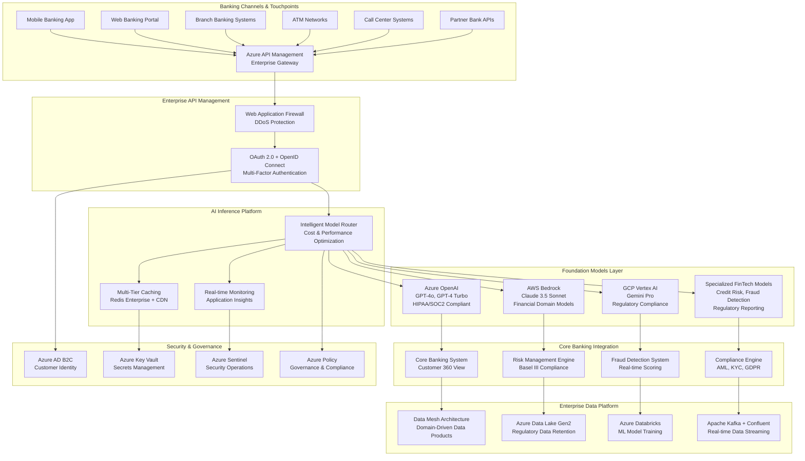
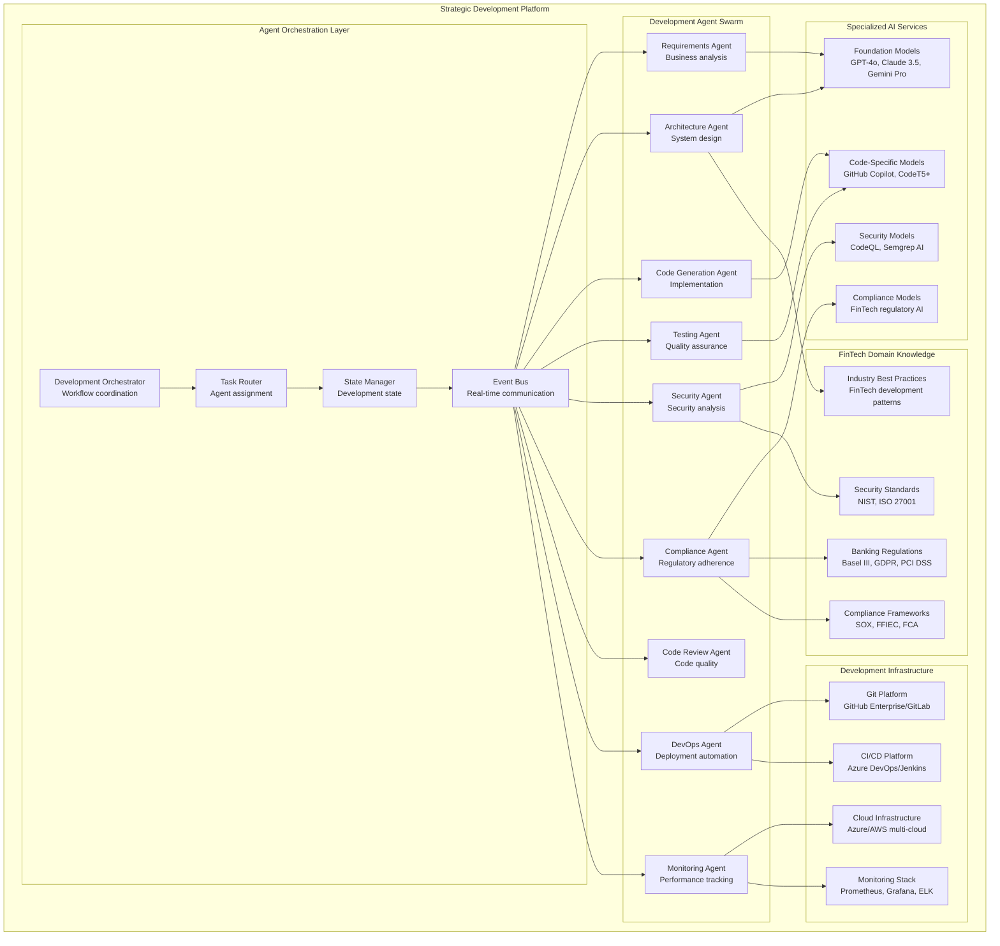
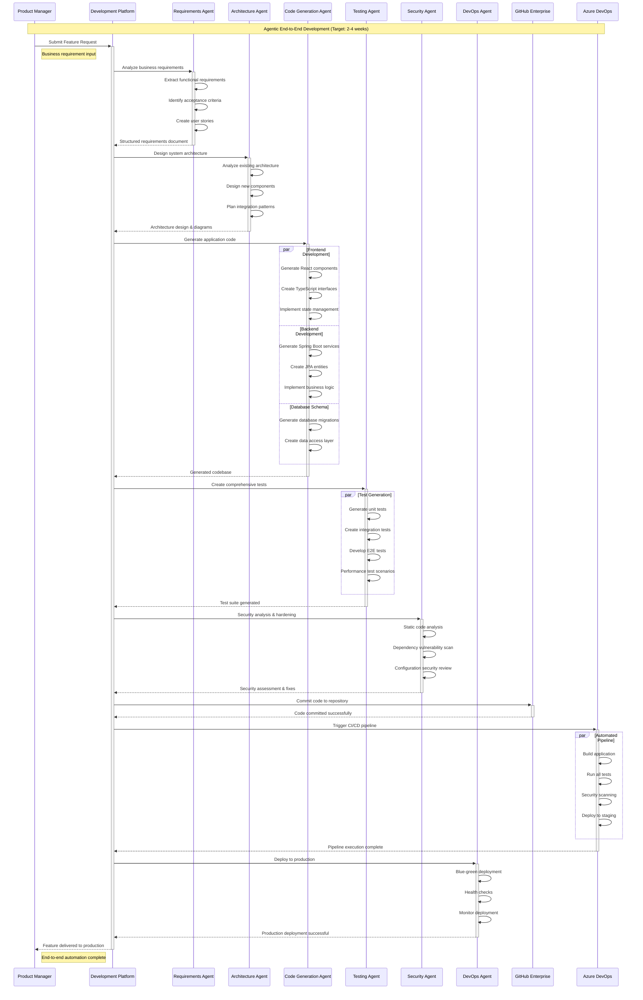
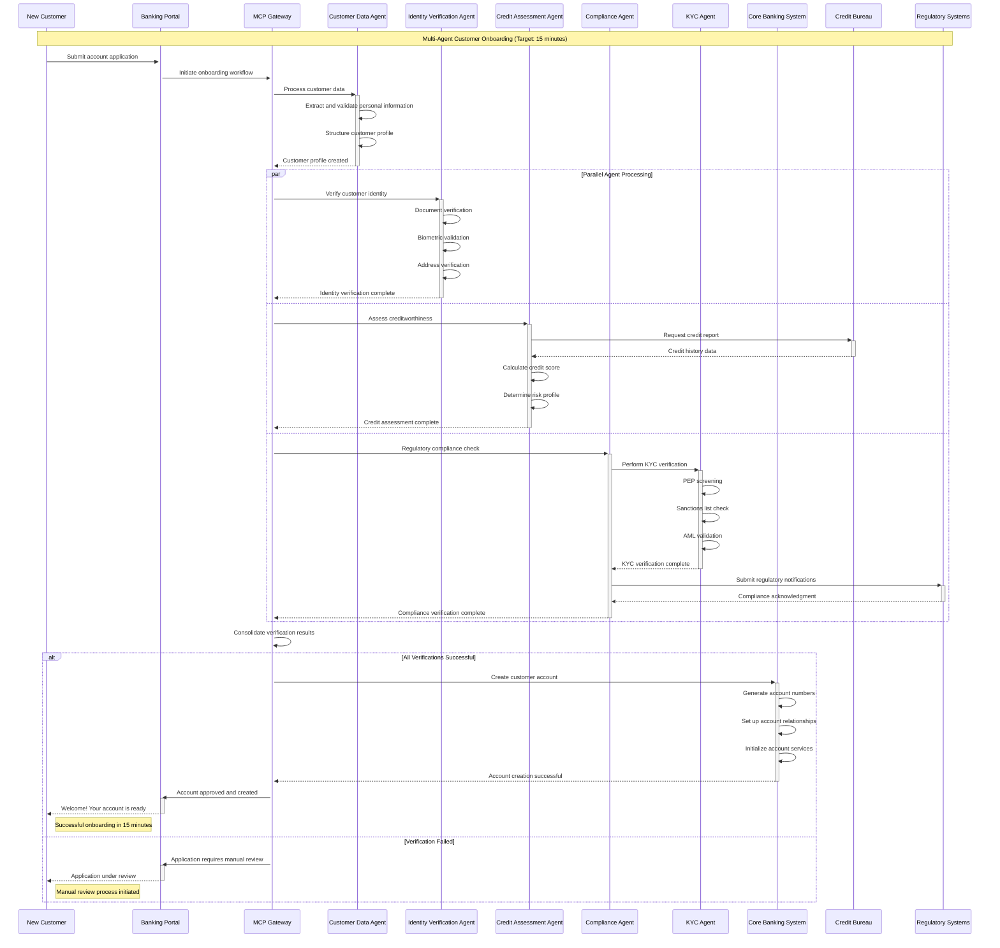

# AI Platform for FinTech Evolution - Executive Overview

## 🎯 Repository Purpose

This repository contains **executive-level documentation** and **high-level architecture artifacts** for the AI Platform for FinTech Evolution project. It is specifically designed for:

- **🎩 Tech Executives & C-Suite Leaders**
- **🏗️ Enterprise Architects & Solution Architects**
- **📊 Business Stakeholders & Investors**

## 🚀 Objective

The AI Platform for FinTech Evolution is designed to **transform legacy FinTech applications to be AI-enabled** through three primary application capabilities:

### **1. 🧠 AI Inference**

- **Foundation Model Selection & Orchestration**: Strategic selection and deployment of optimal foundation models (GPT, Claude, Llama, specialized FinTech models) based on use case requirements
- **Multi-Model Intelligence**: Intelligent routing between different foundation models for optimal performance, cost, and compliance
- **Real-time Intelligent Decision Making**: Sub-second financial operations powered by purpose-built model selection
- **Machine Learning-Driven Risk Assessment**: Advanced fraud detection and risk scoring using ensemble model approaches
- **Predictive Analytics**: Market trends and customer behavior analysis through specialized financial AI models
- **Natural Language Processing**: Document analysis and compliance processing using domain-specific language models
- **Event Streaming Integration**: Apache Kafka, Flink, Spark for real-time, near real-time & batch data processing and inference
- **Model Performance Optimization**: Continuous evaluation and switching between foundation models for optimal results
- **Regulatory AI Governance**: Model explainability, bias detection, and audit trails for regulatory compliance
- **Enterprise Model Registry**: Centralized model versioning, lineage tracking, and governance workflows

### **2. 🤖 Agentic Business Workflow Automation with MCP**

- **Autonomous Business Process Orchestration**: Model Context Protocol-driven intelligent workflow management
- **Intelligent Workflow Optimization**: ML-powered exception handling and process optimization
- **Cross-System Integration**: Intelligent routing and decision logic across core banking systems
- **Self-Healing Operations**: Adaptive workflow management with automatic error recovery
- **Regulatory Workflow Compliance**: Built-in compliance checkpoints and audit trail generation
- **Event-Driven Architecture**: Real-time workflow triggering based on business events and market conditions

### **3. 🔄 Agentic End-to-End Development to Deployment**

- **Automated Feature Development**: Requirements to production with AI-driven development lifecycle
- **Micro Frontend Architecture**: Scalable UI architecture with independent deployment capabilities
- **Microservice Orchestration**: Domain-driven design with API-first development approach
- **Strangler Pattern Implementation**: Gradual legacy system modernization without business disruption
- **Data Mesh Architecture**: Domain-based data products with federated governance
- **DevSecOps Integration**: Security-first development with automated compliance validation
- **Cloud-Native Deployment**: Container-orchestrated deployment with auto-scaling capabilities

## 📊 Strategic Response to MIT Research Findings

### **Research Foundation: 95% Enterprise AI Failure Rate**

According to [MIT's NANDA initiative research report "The GenAI Divide: State of AI in Business 2025"](https://finance.yahoo.com/news/mit-report-95-generative-ai-105412686.html), **95% of enterprise generative AI pilot programs fail** to achieve rapid revenue acceleration or deliver measurable impact on profit and loss statements. This research, based on 150 interviews with leaders, a survey of 350 employees, and analysis of 300 public AI deployments, identifies critical failure patterns that our platform directly addresses.

### **How Our Applications Solve MIT-Identified Problems**

#### **🧠 AI Inference → Addresses "Misplaced Spending" & "Integration Gaps"**

- **Strategic Foundation Model Selection**: Optimal model choice (GPT, Claude, Llama, FinTech-specific models) ensuring cost-effective back-office automation
- **Multi-Model Intelligence**: Smart routing between foundation models for performance optimization and cost control
- **Back-Office ROI Focus**: Targets customer service automation and fraud detection (highest ROI areas per MIT research)
- **Real-Time Financial Integration**: Event streaming with Kafka/Flink ensures tight coupling with core banking processes
- **Production-Ready Deployment**: Avoids the prototype trap through immediate production capabilities

#### **🤖 Agentic Workflow Automation → Solves "Stalled Innovation" & "Shadow AI"**

- **Production-First Architecture**: MCP design enables immediate scaling from pilot to enterprise deployment
- **Governed AI Framework**: Provides powerful enterprise alternatives preventing unauthorized consumer tool usage
- **Self-Healing Operations**: Autonomous workflow management that adapts without manual intervention

#### **🔄 Agentic Development → Addresses "Internal Development Gap"**

- **Hybrid Success Strategy**: Combines 67% vendor success rate with FinTech-specific customization
- **Gradual Modernization**: Strangler pattern avoids "big bang" internal development failures
- **Domain-Based Architecture**: Leverages proven external tools while maintaining internal control

### **Strategic Platform Differentiation**

| **MIT Failure Pattern** | **Our Solution** | **Business Impact** |
|-------------------------|------------------|-------------------|
| **95% Pilots Trapped in Testing** | Production-first MCP architecture | Immediate scaling capability |
| **Misplaced Budget Allocation** | Back-office automation focus | Higher ROI targeting |
| **33% Internal Development Success** | Hybrid vendor + custom approach | 67% success rate achievement |
| **Shadow AI Proliferation** | Governed enterprise framework | Controlled powerful alternatives |
| **Poor Business Integration** | Event-driven architecture | Deep financial process coupling |

**Sources:**

- [MIT NANDA Research: "The GenAI Divide: State of AI in Business 2025"](https://finance.yahoo.com/news/mit-report-95-generative-ai-105412686.html)
- [National CIO Review: Enterprise AI Implementation Analysis](https://nationalcioreview.com/articles-insights/extra-bytes/mit-finds-genai-projects-fail-roi-in-95-of-companies/)

## Level 0 Architecture - Enterprise AI Platform

### AI Inference Platform Architecture



### Agentic Business Workflow Automation Architecture

```mermaid
graph TB
    subgraph "Human-AI Collaboration Layer"
        BusinessUser[Business Users<br/>Loan Officers, Risk Analysts]
        Supervisor[Supervisory Approval<br/>Senior Management]
        ComplianceOfficer[Compliance Officers<br/>Regulatory Oversight]
        
        BusinessUser --> MCPGateway
        Supervisor --> MCPGateway
        ComplianceOfficer --> MCPGateway
    end
    
    subgraph "MCP Gateway & Orchestration"
        MCPGateway[MCP Gateway<br/>Unified Agent Interface]
        WorkflowOrchestrator[Workflow Orchestrator<br/>Multi-Agent Coordination]
        TaskRouter[Task Router<br/>Agent Assignment]
        
        MCPGateway --> WorkflowOrchestrator
        WorkflowOrchestrator --> TaskRouter
    end
    
    subgraph "Single Agent Automation (Phase 1)"
        direction TB
        LoanAgent[Loan Processing Agent<br/>MCP Server: loan-automation]
        KYCAgent[KYC Compliance Agent<br/>MCP Server: kyc-verification]
        RiskAgent[Risk Assessment Agent<br/>MCP Server: risk-analysis]
        
        TaskRouter --> LoanAgent
        TaskRouter --> KYCAgent
        TaskRouter --> RiskAgent
    end
    
    subgraph "Multi-Agent Orchestration (Phase 2)"
        direction TB
        
        subgraph "Customer Onboarding Swarm"
            CustomerAgent[Customer Data Agent]
            IdentityAgent[Identity Verification Agent]
            CreditAgent[Credit Assessment Agent]
            ComplianceAgent[Compliance Verification Agent]
            
            CustomerAgent <--> IdentityAgent
            IdentityAgent <--> CreditAgent
            CreditAgent <--> ComplianceAgent
        end
        
        subgraph "Transaction Processing Swarm"
            PaymentAgent[Payment Processing Agent]
            FraudAgent[Fraud Detection Agent]
            AMLAgent[AML Monitoring Agent]
            SettlementAgent[Settlement Agent]
            
            PaymentAgent <--> FraudAgent
            FraudAgent <--> AMLAgent
            AMLAgent <--> SettlementAgent
        end
        
        subgraph "Risk Management Swarm"
            CreditRiskAgent[Credit Risk Agent]
            MarketRiskAgent[Market Risk Agent]
            OperationalRiskAgent[Operational Risk Agent]
            PortfolioAgent[Portfolio Management Agent]
            
            CreditRiskAgent <--> MarketRiskAgent
            MarketRiskAgent <--> OperationalRiskAgent
            OperationalRiskAgent <--> PortfolioAgent
        end
        
        WorkflowOrchestrator --> CustomerAgent
        WorkflowOrchestrator --> PaymentAgent
        WorkflowOrchestrator --> CreditRiskAgent
    end
    
    subgraph "MCP Framework Core"
        MCPRegistry[MCP Server Registry<br/>Agent Discovery]
        MCPLifecycle[MCP Lifecycle Manager<br/>Agent Deployment]
        ProtocolHandler[JSON-RPC Protocol Handler<br/>Inter-Agent Communication]
        StateManager[Workflow State Manager<br/>Conversation Memory]
        
        MCPRegistry --> MCPLifecycle
        MCPLifecycle --> ProtocolHandler
        ProtocolHandler --> StateManager
    end
    
    subgraph "Banking Domain Services (MCP Servers)"
        direction LR
        CustomerMCP[Customer Management<br/>MCP Server]
        AccountMCP[Account Operations<br/>MCP Server]
        TransactionMCP[Transaction Processing<br/>MCP Server]
        RiskMCP[Risk Management<br/>MCP Server]
        ComplianceMCP[Compliance & Reporting<br/>MCP Server]
        
        CustomerMCP --> MCPRegistry
        AccountMCP --> MCPRegistry
        TransactionMCP --> MCPRegistry
        RiskMCP --> MCPRegistry
        ComplianceMCP --> MCPRegistry
    end
    
    subgraph "External Systems Integration"
        CoreBanking[Core Banking System<br/>Temenos, FIS]
        CreditBureau[Credit Bureau APIs<br/>Experian, Equifax]
        RegulatoryAPI[Regulatory Systems<br/>Federal Reserve, OCC]
        PartnerBanks[Partner Bank APIs<br/>Correspondent Banking]
        
        CustomerMCP --> CoreBanking
        AccountMCP --> CreditBureau
        ComplianceMCP --> RegulatoryAPI
        TransactionMCP --> PartnerBanks
    end
    
    subgraph "Event-Driven Architecture"
        EventBus[Apache Kafka<br/>Event Streaming]
        EventStore[Event Store<br/>Audit Trail]
        CQRS[CQRS Pattern<br/>Command/Query Separation]
        
        EventBus --> EventStore
        EventStore --> CQRS
    end
    
    StateManager --> EventBus
    CustomerMCP --> EventBus
    TransactionMCP --> EventBus
    ComplianceMCP --> EventBus
```



### Agentic End-to-End Development Architecture



## Level 0 Sequence Diagrams - AI Applications

### Real-Time Fraud Detection Sequence

```mermaid
sequenceDiagram
    participant Customer as Customer
    participant POS as Point of Sale
    participant Gateway as Payment Gateway
    participant AuthSvc as Authorization Service
    participant AIRouter as AI Model Router
    participant Cache as Redis Cache
    participant FraudModel as Fraud Detection Model
    participant RiskEngine as Risk Engine
    participant CoreBanking as Core Banking
    participant Monitor as Monitoring

    Note over Customer,Monitor: Real-Time Fraud Detection (Target: < 100ms)
    
    Customer->>+POS: Swipe/Insert Card
    Note right of Customer: t=0ms - Transaction initiated
    
    POS->>+Gateway: Transaction Request
    Note right of POS: t=5ms - POS processing
    
    Gateway->>+AuthSvc: Authorization Request + Customer ID
    Note right of Gateway: t=10ms - Gateway routing
    
    AuthSvc->>+Cache: Check fraud pattern cache
    activate Cache
    Note right of AuthSvc: t=15ms - Cache lookup
    
    alt Cache Hit (Fraud Pattern Exists)
        Cache-->>AuthSvc: Known fraud pattern
        deactivate Cache
        Note right of Cache: t=20ms - Immediate response
        AuthSvc->>+Monitor: Log fraud attempt
        deactivate Monitor
        AuthSvc-->>Gateway: DECLINE (High Risk)
        deactivate AuthSvc
        Gateway-->>POS: Transaction Declined
        deactivate Gateway
        POS-->>Customer: Card Declined
        deactivate POS
        Note right of Customer: t=30ms TOTAL - Fast decline
    else Cache Miss (New Pattern)
        Cache-->>AuthSvc: No cached result
        deactivate Cache
        Note right of Cache: t=20ms - Cache miss
        
        AuthSvc->>+AIRouter: Real-time fraud analysis request
        Note right of AuthSvc: t=25ms - AI routing
        
        AIRouter->>+FraudModel: Analyze transaction pattern
        Note right of AIRouter: t=30ms - Model selection
        
        par Parallel Analysis
            FraudModel->>FraudModel: Pattern matching
            Note right of FraudModel: t=30-60ms - AI processing
        and
            AuthSvc->>+RiskEngine: Customer risk profile
            RiskEngine->>+CoreBanking: Account history
            CoreBanking-->>RiskEngine: Transaction history
            deactivate CoreBanking
            RiskEngine-->>AuthSvc: Risk score
            deactivate RiskEngine
        end
        
        FraudModel-->>AIRouter: Fraud probability score
        deactivate FraudModel
        Note right of FraudModel: t=65ms - AI result
        
        AIRouter-->>AuthSvc: Consolidated fraud assessment
        deactivate AIRouter
        Note right of AIRouter: t=70ms - Result consolidation
        
        alt Low Risk Score (< 0.3)
            AuthSvc->>+Cache: Cache approval pattern
            activate Cache
            deactivate Cache
            AuthSvc-->>Gateway: APPROVE
            deactivate AuthSvc
            Gateway-->>POS: Transaction Approved
            deactivate Gateway
            POS-->>Customer: Payment Successful
            deactivate POS
            Note right of Customer: t=85ms TOTAL - Fast approval
        else Medium Risk Score (0.3-0.7)
            AuthSvc->>+Monitor: Log suspicious activity
            deactivate Monitor
            AuthSvc-->>Gateway: APPROVE with monitoring
            deactivate AuthSvc
            Gateway-->>POS: Transaction Approved
            deactivate Gateway
            POS-->>Customer: Payment Successful
            deactivate POS
            Note right of Customer: t=95ms TOTAL - Monitored approval
        else High Risk Score (> 0.7)
            AuthSvc->>+Cache: Cache decline pattern
            activate Cache
            deactivate Cache
            AuthSvc->>+Monitor: Log fraud attempt
            deactivate Monitor
            AuthSvc-->>Gateway: DECLINE (AI Detected Risk)
            deactivate AuthSvc
            Gateway-->>POS: Transaction Declined
            deactivate Gateway
            POS-->>Customer: Transaction Declined
            deactivate POS
            Note right of Customer: t=100ms TOTAL - AI-based decline
        end
    end
```

### Agentic Development Lifecycle Sequence



### Multi-Agent Customer Onboarding Workflow



## 🎯 Implementation Roadmap

### Phase 1: Foundation (Months 1-6)

- Deploy AI Inference platform with foundation models
- Implement single-agent MCP automation
- Establish security and compliance frameworks
- Deploy basic development automation

### Phase 2: Scale (Months 7-18)

- Multi-agent orchestration deployment
- Advanced workflow automation
- Complete development lifecycle automation
- Enhanced analytics and monitoring

### Phase 3: Optimization (Months 19-36)

- AI-driven optimization engines
- Predictive automation capabilities
- Advanced multi-agent collaboration
- Continuous improvement frameworks

## 📊 Financial Analysis & Business Impact

### Strategic Value Overview

#### 3-Year Total Value Creation: $113M

| Component | Investment | Value | Net ROI | Payback |
|-----------|------------|-------|---------|---------|
| AI Inference Platform | $3.0M | $7.8M | 260% | 11 months |
| Agentic Workflow Automation | $6.0M | $38.85M | 643% | 9 months |
| Development Lifecycle Automation | $4.2M | $42M | 542% | 7 months |
| Risk Mitigation & Compliance | $2.0M | $24.35M | 389% | 12 months |
| **Total Platform Investment** | **$15.2M** | **$113M** | **643%** | **14 months** |

### Market Validation & Benchmarks

- **Enterprise AI Market**: $150B by 2025 (IDC), 15.2% CAGR
- **Banking AI Adoption**: 85% of Tier 1 banks actively deploying AI (Accenture 2024)
- **Average AI ROI in Banking**: 4.2x investment within 24 months (McKinsey Global Banking Report)
- **Competitive Advantage**: 67% faster time-to-market vs traditional development (Forrester)

### Financial Impact Details

#### Year 1 Savings & Revenue

- **Operational Cost Reduction**: $18.2M (40% process automation)
- **Fraud Loss Prevention**: $8.5M (60% improvement in fraud detection)
- **Compliance Cost Reduction**: $6.8M (automated regulatory reporting)
- **Developer Productivity**: $12.3M (85% faster feature delivery)

#### Year 2-3 Compound Benefits

- **Customer Acquisition**: $24.7M (AI-powered personalization and onboarding)
- **Risk-Adjusted Revenue**: $18.9M (improved credit decisioning and portfolio optimization)
- **Market Expansion**: $15.6M (rapid product launch capabilities)
- **Regulatory Advantage**: $9.3M (proactive compliance and reporting)

### Risk Mitigation Value

- **Regulatory Penalty Avoidance**: $12M (historical average for non-compliance)
- **Cybersecurity Enhancement**: $6.2M (reduction in potential breach costs)
- **Operational Risk Reduction**: $4.8M (automated error detection and correction)
- **Technology Debt Reduction**: $1.35M (modernization of legacy systems)

📊 **[View Detailed Financial Analysis](./financial/README.md)** - Complete ROI breakdown, cost optimization strategies, and 3-year projections

## 🛠️ Technology Stack

### Foundation Models & AI Services

- **Azure OpenAI**: GPT-4o, GPT-4 Turbo (HIPAA/SOC2 compliant)
- **AWS Bedrock**: Claude 3.5 Sonnet, Amazon Titan (FedRAMP authorized)
- **GCP Vertex AI**: Gemini Pro, PaLM 2 (ISO 27001 certified)
- **Specialized FinTech Models**: Domain-specific fraud detection, credit risk, regulatory compliance
- **Enterprise Model Registry**: MLflow, Azure ML Model Registry for governance
- **Model Monitoring**: Evidently AI, WhyLabs for drift detection and performance monitoring

### Core Banking Integration

- **Core Banking Systems**: Temenos T24, FIS Profile, Jack Henry, Fiserv DNA
- **Payment Networks**: SWIFT, FedWire, ACH, RTP (Real-Time Payments)
- **Credit Bureaus**: Experian, Equifax, TransUnion API integration
- **Regulatory Reporting**: Federal Reserve, OCC, FDIC automated reporting
- **Trading Systems**: FIX Protocol integration for capital markets

### Development & DevOps

- **Frontend**: React 19, Next.js 15, TypeScript with micro-frontend architecture
- **Backend**: Java Spring Boot 3.2+, Spring Cloud Gateway, Spring Security
- **Database**: PostgreSQL 15+ with high availability, Redis Enterprise for caching
- **Message Broker**: Apache Kafka with Confluent Platform for enterprise features
- **Cloud**: Multi-cloud Azure/AWS with disaster recovery and failover
- **CI/CD**: Azure DevOps, GitHub Enterprise with automated security scanning
- **Container Platform**: Kubernetes with Istio service mesh for microservices

### Data & Analytics Platform

- **Event Streaming**: Apache Kafka with Confluent Cloud, Schema Registry
- **Data Lake**: Azure Data Lake Gen2 with Delta Lake for ACID transactions
- **Analytics Engine**: Azure Databricks, Apache Spark for large-scale processing
- **Real-Time Analytics**: Apache Flink, Azure Stream Analytics
- **Data Governance**: Apache Atlas, Microsoft Purview for data cataloging
- **Monitoring**: Application Insights, Prometheus, Grafana with custom FinTech dashboards

## 🔐 Enterprise Security & Compliance

### Security Framework

- **Zero Trust Architecture**: NIST Cybersecurity Framework implementation with continuous verification
- **Identity & Access Management**: Azure AD B2C, OAuth 2.0, SAML 2.0, Multi-Factor Authentication
- **Data Protection**: AES-256 encryption at rest, TLS 1.3 in transit, HSM key management
- **Threat Detection**: Azure Sentinel, Splunk SIEM with behavioral analytics
- **Network Security**: Web Application Firewall, DDoS protection, network segmentation
- **API Security**: OAuth 2.0, JWT tokens, rate limiting, API gateway protection

### Regulatory Compliance Framework

- **Basel III/IV**: Capital adequacy ratios, liquidity coverage, operational risk management
- **GDPR/CCPA**: Data privacy, right to erasure, consent management, data portability
- **PCI DSS Level 1**: Payment card data protection, secure card processing
- **SOX (Sarbanes-Oxley)**: Financial reporting controls, audit trails, data integrity
- **FFIEC Guidelines**: Federal Financial Institutions Examination Council compliance
- **AML/BSA**: Anti-Money Laundering, Bank Secrecy Act, suspicious activity monitoring
- **KYC/CDD**: Know Your Customer, Customer Due Diligence with real-time verification
- **FIDO2/WebAuthn**: Strong customer authentication for PSD2 compliance
- **ISO 27001**: Information security management system certification

### Data Governance & Privacy

- **Data Classification**: Automatic PII detection and classification
- **Data Loss Prevention**: Real-time monitoring and protection of sensitive data
- **Audit Logging**: Immutable audit trails with tamper detection
- **Right to be Forgotten**: Automated data deletion workflows for privacy compliance
- **Cross-Border Data Transfer**: GDPR Article 49 compliance for international operations

## 🚀 Quick Start

### Prerequisites

- Azure subscription with appropriate permissions
- AWS account for multi-cloud deployment
- Docker and Kubernetes cluster access
- GitHub Enterprise or similar Git platform

### Deployment

1. **Clone Repository**: `git clone https://github.com/calvinlee999/AI-Platform-for-FinTech-Evolution.git`
2. **Configure Environment**: Set up cloud credentials and configuration
3. **Deploy Infrastructure**: Run Terraform/Bicep scripts for cloud resources
4. **Deploy Applications**: Use Azure DevOps pipelines for application deployment
5. **Verify Deployment**: Run health checks and monitoring validation

### Demo Access

- **Frontend Portal**: Accessible after deployment
- **MCP Demo Interface**: Interactive agent demonstration
- **API Documentation**: OpenAPI specifications available
- **Monitoring Dashboards**: Real-time system metrics

## 📚 Documentation

### Architecture Documents

- **[AI Inference Architecture](docs/ai-inference-architecture.md)** - Detailed inference platform design
- **[MCP Framework Guide](docs/mcp-framework-guide.md)** - Model Context Protocol implementation
- **[Development Automation](docs/development-automation.md)** - Agentic development processes
- **[Security Framework](docs/security-framework.md)** - Enterprise security implementation

### Sequence Diagrams

- **[AI Application Flows](docs/ai-sequence-diagrams.md)** - Detailed interaction patterns
- **[Development Lifecycle](docs/development-sequence-diagrams.md)** - Development automation flows
- **[Business Workflows](docs/business-sequence-diagrams.md)** - Multi-agent business processes

## 🤝 Contributing

This is an enterprise architecture repository. For contribution guidelines and development standards, please see:

- **[Contribution Guidelines](CONTRIBUTING.md)**
- **[Code Standards](docs/code-standards.md)**
- **[Architecture Decisions](docs/architecture-decisions.md)**

## 📄 License

This project is licensed under the MIT License - see the [LICENSE](LICENSE) file for details.

## 📞 Contact & Support

- **Enterprise Architecture Team**: <architects@fintech-evolution.com>
- **Technical Support**: <support@fintech-evolution.com>
- **Business Inquiries**: <business@fintech-evolution.com>

---

### Built for the future of FinTech automation - Transforming banking through AI-native architecture
