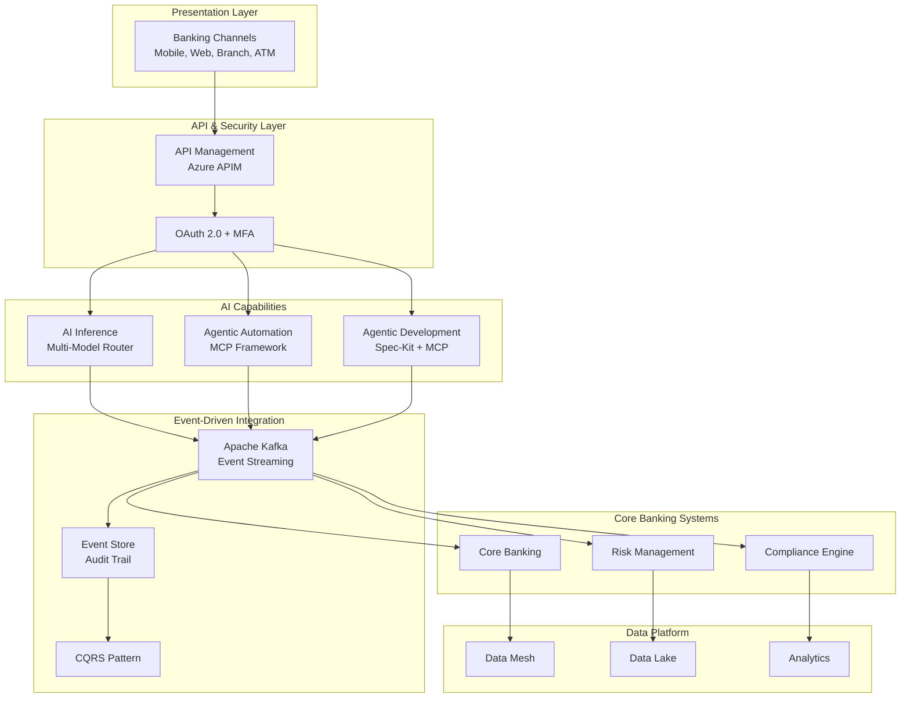

# AI Platform for FinTech Evolution - Executive Overview

## 🎯 Repository Purpose

This repository provides **executive-level documentation** and **high-level architecture** for an enterprise AI platform designed to transform legacy FinTech applications. ### Quantitative Business Impact

| **Metric** | **Traditional** | **Spec-Driven** | **Improvement** |
|-----------|----------------|-----------------|-----------------||
| Feature Delivery | 2-4 weeks (80-160 hrs) | 8 hours | **95% faster (99.7% with parallelization)** |
| Annual Cost (40 features) | $640,000 | $20,000 | **$620,000 saved** |
| Requirements Drift | High | Zero | **100% elimination** |
| Test Coverage | Variable (30-60%) | **Unit 85%+, Integration 80%+, E2E 90%+** | **Comprehensive & enforced** |
| Compliance Validation | Manual (2-3 days) | Automatic (30 mins) | **99% faster** |
| DoR to DoD Time | 160+ hours | 8 hours | **95% reduction** |

**Testing Breakdown:**
- **BDD Scenarios**: Automated from `/specify` user stories
- **TDD Implementation**: Tests written before code
- **Unit Tests**: 85%+ code coverage (NON-NEGOTIABLE)
- **Integration Tests**: 80%+ API/service integration coverage
- **E2E Functional Tests**: 90%+ user journey coverage
- **Performance Tests**: Load/stress testing included
- **Security Tests**: OWASP Top 10 validationfor C-suite leaders, enterprise architects, and business stakeholders.

## 🚀 Platform Objective

Transform legacy FinTech applications to be AI-enabled through three strategic capabilities delivering **measurable business outcomes** that address the [MIT-identified 95% enterprise AI failure rate](https://finance.yahoo.com/news/mit-report-95-generative-ai-105412686.html).

### **Three Core Capabilities**

| **Capability** | **Business Value** | **Time to Value** |
|----------------|-------------------|-------------------|
| **🧠 AI Inference** | Cost-effective back-office automation with foundation model optimization | 4-6 weeks |
| **🤖 Agentic Workflow Automation** | Autonomous business process orchestration with self-healing operations | 6-8 weeks |
| **🔄 Agentic Development** | 8-hour feature delivery (vs 2-4 weeks) with 99.7% faster time to production, full BDD/TDD/Integration/E2E testing | 1 week |

## 📊 Strategic Differentiation vs MIT Research Findings

| **MIT Failure Pattern** | **Our Solution** | **Business Impact** |
|-------------------------|------------------|-------------------|
| 95% Pilots Trapped in Testing | Production-first MCP architecture | Immediate scaling capability |
| Misplaced Budget Allocation | Back-office automation focus | Higher ROI targeting |
| 33% Internal Development Success | Hybrid vendor + custom approach | 67% success rate |
| Shadow AI Proliferation | Governed enterprise framework | Controlled alternatives |
| Poor Business Integration | Event-driven architecture | Deep process coupling |

**Research Sources:**
- [MIT NANDA: "The GenAI Divide: State of AI in Business 2025"](https://finance.yahoo.com/news/mit-report-95-generative-ai-105412686.html)
- [National CIO Review: Enterprise AI Implementation Analysis](https://nationalcioreview.com/articles-insights/extra-bytes/mit-finds-genai-projects-fail-roi-in-95-of-companies/)

---

## 1️⃣ AI Inference Capability

### Strategic Value Proposition

- **Foundation Model Orchestration**: Intelligent routing between GPT, Claude, Llama, and specialized FinTech models
- **Multi-Model Intelligence**: Cost optimization through optimal model selection per use case
- **Real-Time Processing**: Sub-second financial operations with event streaming (Kafka/Flink)
- **Regulatory Compliance**: Model explainability, bias detection, and audit trails

### Key Features

✅ Strategic foundation model selection for cost-effective automation  
✅ Multi-tier caching and performance optimization  
✅ Event streaming integration for real-time inference  
✅ Enterprise model registry with versioning and governance  
✅ Regulatory AI governance (PCI DSS, GDPR, SOX)  

**📖 [Detailed Architecture →](docs/AI_INFERENCE_ARCHITECTURE.md)**

---

## 2️⃣ Agentic Business Workflow Automation

### Strategic Value Proposition

- **Model Context Protocol (MCP) Framework**: Production-first architecture for enterprise-scale agent deployment
- **Event-Driven Orchestration**: Real-time workflow triggering based on business events
- **Self-Healing Operations**: Autonomous error recovery and adaptive workflow management
- **Multi-Agent Collaboration**: Coordinated agent swarms for complex business processes

### MCP Server Architecture

#### **Domain-Based MCP Servers**

```
┌─────────────────────────────────────────────────────────────────┐
│                  MCP Gateway & Orchestration                     │
│  ┌──────────────┐  ┌──────────────┐  ┌──────────────┐          │
│  │ MCP Gateway  │→│ Orchestrator │→│ Task Router  │          │
│  └──────────────┘  └──────────────┘  └──────────────┘          │
└─────────────────────────────────────────────────────────────────┘
                              ↓
┌─────────────────────────────────────────────────────────────────┐
│                 Banking Domain MCP Servers                       │
│  ┌──────────────────┐  ┌──────────────────┐                    │
│  │ Customer MCP     │  │ Account MCP      │                    │
│  │ ├─ Onboarding    │  │ ├─ Operations    │                    │
│  │ ├─ KYC/AML       │  │ ├─ Balance Mgmt  │                    │
│  │ └─ Profile Mgmt  │  │ └─ Statements    │                    │
│  └──────────────────┘  └──────────────────┘                    │
│                                                                  │
│  ┌──────────────────┐  ┌──────────────────┐                    │
│  │ Transaction MCP  │  │ Risk MCP         │                    │
│  │ ├─ Payment Proc  │  │ ├─ Credit Risk   │                    │
│  │ ├─ Fraud Det     │  │ ├─ Market Risk   │                    │
│  │ └─ Settlement    │  │ └─ Operational   │                    │
│  └──────────────────┘  └──────────────────┘                    │
│                                                                  │
│  ┌──────────────────┐  ┌──────────────────┐                    │
│  │ Compliance MCP   │  │ Lending MCP      │                    │
│  │ ├─ Regulatory    │  │ ├─ Loan Orig     │                    │
│  │ ├─ Audit Trail   │  │ ├─ Underwriting  │                    │
│  │ └─ Reporting     │  │ └─ Servicing     │                    │
│  └──────────────────┘  └──────────────────┘                    │
└─────────────────────────────────────────────────────────────────┘
                              ↓
┌─────────────────────────────────────────────────────────────────┐
│              Event-Driven Integration Layer                      │
│  ┌──────────────┐  ┌──────────────┐  ┌──────────────┐          │
│  │ Kafka Events │→│ Event Store  │→│ CQRS Pattern │          │
│  └──────────────┘  └──────────────┘  └──────────────┘          │
└─────────────────────────────────────────────────────────────────┘
```

### Event-Driven Architecture

**Real-Time Event Processing:**

```yaml
Event Sources:
  - Customer Actions (onboarding, login, transaction)
  - System Events (fraud alert, balance threshold, regulatory trigger)
  - External Events (market data, credit bureau updates, partner notifications)

Event Streaming:
  - Apache Kafka: Event backbone with topic-based routing
  - Event Store: Immutable audit trail with event sourcing
  - CQRS: Separate read/write models for optimal performance

MCP Integration:
  - Event → MCP Gateway → Agent Assignment → Business Logic → Response
  - Asynchronous processing with guaranteed delivery
  - State management across distributed agents
```

### Multi-Agent Orchestration Patterns

| **Pattern** | **Use Case** | **Agents Involved** |
|------------|-------------|---------------------|
| **Sequential** | Loan origination pipeline | Credit → KYC → Risk → Compliance |
| **Parallel** | Customer onboarding | Identity, Credit, Fraud (simultaneous) |
| **Hierarchical** | Risk assessment | Market → Credit → Operational → Portfolio |
| **Event-Driven** | Fraud detection | Transaction → Fraud → AML → Alert |

**📖 [Detailed MCP Architecture →](docs/MCP_FRAMEWORK_ARCHITECTURE.md)**  
**📖 [Event-Driven Patterns →](docs/EVENT_DRIVEN_ARCHITECTURE.md)**

---

## 3️⃣ Agentic End-to-End Development to Deployment

### Strategic Value Proposition

**Specification-Driven Development (SDD)** powered by GitHub Spec-Kit delivers production-ready features in **8 hours** (vs. 2-4 weeks traditional), achieving **99.7% faster time to production** with comprehensive testing coverage including **BDD (Behavior-Driven Development), TDD (Test-Driven Development), Unit Testing, Integration Testing, and End-to-End Functional Testing**. Delivers **$620K annual savings** (for 40 features/year).

**Scope Definition:**
- **Definition of Ready (DoR)**: Feature specification complete, acceptance criteria defined, technical dependencies identified, test scenarios documented
- **Definition of Done (DoD)**: Code complete, all tests passing (unit 85%+, integration 80%+, E2E 90%+), security scan passed, compliance validated, documentation updated, deployed to staging

### Core Workflow Commands

| **Phase** | **Command** | **Agent** | **Output** | **Time** |
|-----------|------------|-----------|-----------|----------|
| **Constitution** | `/constitution` | Constitution Manager | Development principles | One-time |
| **Specification (DoR)** | `/specify` | Requirements Agent | Feature spec + user stories + BDD scenarios | 30 mins |
| **Clarification** | `/clarify` | Requirements Agent | Resolved ambiguities + acceptance criteria | 30 mins |
| **Planning** | `/plan` | Architecture Agent | Technical plan + contracts + test strategy | 45 mins |
| **Tasks** | `/tasks` | Task Router | Parallelized task list + test tasks | 15 mins |
| **Implementation** | `/implement` | Code + Test Agents | Production code (TDD) | 2 hours |
| **Unit Testing** | Auto-generated | Testing MCP | Unit tests (85%+ coverage) | 1 hour |
| **Integration Testing** | Auto-generated | Testing MCP | Integration tests (80%+ coverage) | 1.5 hours |
| **E2E Testing** | Auto-generated | Testing MCP | End-to-end functional tests (90%+ scenarios) | 1 hour |
| **Security & Compliance** | `/analyze` | Security + Compliance MCP | Vulnerability scan + compliance validation | 30 mins |
| **Deployment (DoD)** | Auto | DevOps MCP | Deploy to staging + monitoring | 30 mins |

**Total:** 8 hours end-to-end (from DoR to DoD)

### Definition of Ready (DoR) & Definition of Done (DoD)

#### **Definition of Ready (DoR)** - Feature Intake Criteria

A feature is ready to begin development when ALL criteria are met:

| **Category** | **Criteria** | **Validation** |
|-------------|-------------|----------------|
| **Requirements** | Feature specification complete with clear objectives | `/specify` command executed |
| **User Stories** | User stories written with acceptance criteria | BDD scenarios documented |
| **Technical Dependencies** | All external services, APIs, and libraries identified | Architecture review complete |
| **Test Scenarios** | Test cases documented (unit, integration, E2E) | Test strategy approved |
| **Data Requirements** | Database schema, migrations, and test data defined | Data model validated |
| **Security & Compliance** | Security requirements and compliance needs identified | Risk assessment complete |
| **Environment** | Development and staging environments available | Infrastructure ready |
| **Estimation** | Complexity and effort estimated (8-hour target) | Planning poker complete |

**DoR Validation:** Requirements Agent (`/specify` + `/clarify`) ensures all DoR criteria are met before proceeding.

#### **Definition of Done (DoD)** - Feature Completion Criteria

A feature is complete and ready for production when ALL criteria are met:

| **Category** | **Criteria** | **Validation** |
|-------------|-------------|----------------|
| **Code Complete** | All code written following TDD principles | Code review passed |
| **Unit Tests** | 85%+ code coverage achieved | Automated test report |
| **Integration Tests** | 80%+ API/service integration coverage | Integration test suite passed |
| **E2E Tests** | 90%+ user journey scenarios covered | E2E test automation passed |
| **BDD Scenarios** | All acceptance criteria validated | Cucumber/SpecFlow reports |
| **Performance Tests** | Load testing passed (<500ms p95 response time) | Performance benchmarks met |
| **Security Scan** | OWASP Top 10 validated, zero critical vulnerabilities | Security MCP approval |
| **Compliance Check** | PCI DSS, GDPR, SOX requirements validated | Compliance MCP approval |
| **Code Quality** | SonarQube quality gate passed (A rating) | Static analysis passed |
| **Documentation** | API docs, README, and architecture diagrams updated | Documentation review complete |
| **Deployment** | Successfully deployed to staging environment | CI/CD pipeline passed |
| **Monitoring** | Health checks and alerts configured | Observability validated |
| **Rollback Plan** | Rollback procedure documented and tested | Disaster recovery ready |

**DoD Validation:** DevOps MCP (`/deploy`) ensures all DoD criteria are met before production release.

#### **Feature Delivery Scope**

**What's Included in 8-Hour Feature Delivery:**

✅ Complete feature specification with BDD scenarios  
✅ Architecture design and technical planning  
✅ TDD implementation (tests first, then code)  
✅ Unit tests with 85%+ coverage (Jest, JUnit, PyTest)  
✅ Integration tests with 80%+ coverage (API, Database, Services)  
✅ End-to-end functional tests with 90%+ scenario coverage (Selenium, Playwright, Cypress)  
✅ Security vulnerability scanning (OWASP Top 10)  
✅ Compliance validation (PCI DSS, GDPR, SOX)  
✅ Performance testing (load, stress, scalability)  
✅ Code quality analysis (SonarQube, CodeQL)  
✅ Documentation (API docs, architecture diagrams, README)  
✅ Staging deployment with health checks  
✅ Rollback procedure and monitoring setup  

**What's NOT Included (Requires Separate Sprint):**

❌ Large-scale refactoring or architectural changes  
❌ Multi-system integration spanning >3 services  
❌ Data migration involving >100K records  
❌ Manual user acceptance testing (UAT)  
❌ Production deployment and go-live activities  
❌ Post-deployment monitoring and optimization  

**Feature Size Guidelines:**

- **Small Feature**: 4-6 hours (simple CRUD, single service)
- **Medium Feature**: 8 hours (API integration, multi-layer changes)
- **Large Feature**: 16+ hours (complex workflows, requires breakdown into smaller features)

### Development MCP Servers

#### **Specialized Development Agents as MCP Servers**

```
┌─────────────────────────────────────────────────────────────────┐
│              Development Platform MCP Architecture               │
└─────────────────────────────────────────────────────────────────┘

┌─────────────────────────────────────────────────────────────────┐
│                 Specification & Planning Layer                   │
│  ┌──────────────────┐  ┌──────────────────┐                    │
│  │ Requirements MCP │  │ Architecture MCP │                    │
│  │ ├─ Spec Gen      │  │ ├─ Design        │                    │
│  │ ├─ Clarification │  │ ├─ Tech Stack    │                    │
│  │ └─ User Stories  │  │ └─ Integration   │                    │
│  └──────────────────┘  └──────────────────┘                    │
└─────────────────────────────────────────────────────────────────┘
                              ↓
┌─────────────────────────────────────────────────────────────────┐
│                   Implementation Layer                           │
│  ┌──────────────────┐  ┌──────────────────┐                    │
│  │ Code Gen MCP     │  │ Testing MCP      │                    │
│  │ ├─ Frontend      │  │ ├─ BDD Scenarios │                    │
│  │ ├─ Backend       │  │ ├─ TDD (85%+)    │                    │
│  │ ├─ Database      │  │ ├─ Unit Tests    │                    │
│  │ └─ APIs          │  │ ├─ Integration   │                    │
│  └──────────────────┘  │ └─ E2E (90%+)    │                    │
│                        └──────────────────┘                    │
│  └──────────────────┘                                           │
└─────────────────────────────────────────────────────────────────┘
                              ↓
┌─────────────────────────────────────────────────────────────────┐
│              Security, Compliance & Deployment Layer             │
│  ┌──────────────────┐  ┌──────────────────┐                    │
│  │ Security MCP     │  │ Compliance MCP   │                    │
│  │ ├─ Code Analysis │  │ ├─ PCI DSS       │                    │
│  │ ├─ Vuln Scan     │  │ ├─ GDPR          │                    │
│  │ └─ Penetration   │  │ └─ SOX           │                    │
│  └──────────────────┘  └──────────────────┘                    │
│                                                                  │
│  ┌──────────────────┐  ┌──────────────────┐                    │
│  │ DevOps MCP       │  │ Monitoring MCP   │                    │
│  │ ├─ CI/CD         │  │ ├─ Performance   │                    │
│  │ ├─ Deployment    │  │ ├─ Health Check  │                    │
│  │ └─ Rollback      │  │ └─ Alerting      │                    │
│  └──────────────────┘  └──────────────────┘                    │
└─────────────────────────────────────────────────────────────────┘
```

### Event-Driven Development Pipeline

**8-Hour Development Event Flow with Testing Gates:**

```yaml
Development Event Flow (Total: 8 hours):

Phase 1: Specification & Planning (1 hour 15 mins)
  - DoR Validation → FeatureReadyCheck event
  - /specify command → RequirementsCreated event (30 mins)
  - /clarify command → AmbiguitiesResolved event (30 mins)
  - /plan command → ArchitectureDesigned event + TestStrategyDefined (45 mins)
  - Test scenarios → BDDScenariosCreated event (included in /specify)

Phase 2: Task Generation (15 mins)
  - /tasks command → TasksGenerated event + TestTasksCreated
  - Parallel task distribution → AgentsAssigned event
  
Phase 3: TDD Implementation (2 hours)
  - /implement command → CodeGenerationStarted event
  - Unit test creation → UnitTestsGenerated event
  - Implementation → CodeCompleted event (TDD: tests first, then code)
  
Phase 4: Testing Execution (3.5 hours)
  - Unit Testing → UnitTestsExecuted event (1 hour, 85%+ coverage required)
  - Integration Testing → IntegrationTestsExecuted event (1.5 hours, 80%+ coverage)
  - E2E Testing → E2ETestsExecuted event (1 hour, 90%+ scenarios)
  - Performance Testing → PerformanceTestsCompleted event (included in E2E)
  - Test failures → TestFailureNotification + AutoRollback
  
Phase 5: Security & Compliance Validation (30 mins)
  - All tests passed → SecurityScanTriggered event
  - Security scan → VulnerabilityScanCompleted event (OWASP Top 10)
  - Compliance check → ComplianceValidated event (PCI DSS, GDPR, SOX)
  - Quality gate → CodeQualityApproved event (SonarQube A rating)
  
Phase 6: Deployment & DoD Validation (30 mins)
  - All validations passed → DeploymentReady event
  - Staging deployment → StagingDeploymentCompleted event
  - Health checks → HealthChecksPassed event
  - Monitoring setup → MonitoringConfigured event
  - DoD validation → FeatureCompletedDoD event
  - Rollback plan → DisasterRecoveryReady event

Testing Gates (Non-Negotiable):
  - Gate 1: Unit Tests (85%+ coverage) - MUST PASS before integration
  - Gate 2: Integration Tests (80%+ coverage) - MUST PASS before E2E
  - Gate 3: E2E Tests (90%+ scenarios) - MUST PASS before security
  - Gate 4: Security & Compliance - MUST PASS before deployment
  - Gate 5: Staging Deployment - MUST PASS before DoD approval

Event Processing:
  - Each event triggers appropriate MCP server
  - State maintained across 8-hour development lifecycle
  - Automatic rollback on any test failure
  - Complete audit trail of all development activities
  - Quality gates enforced at each phase
```

### Constitutional Governance

**Nine Immutable Development Principles:**

| **Article** | **Principle** | **MCP Enforcement** |
|------------|--------------|---------------------|
| **I** | Library-First | Every feature as standalone library |
| **II** | CLI Interface Mandate | All MCP servers expose CLI |
| **III** | Test-First Imperative | Tests before implementation (NON-NEGOTIABLE) |
| **VII** | Simplicity Gate | Max 3 projects, no future-proofing |
| **VIII** | Anti-Abstraction | Use frameworks directly |
| **IX** | Integration-First | Real databases, actual services |
| **X** | Financial Compliance | PCI DSS, GDPR, SOX validation |
| **XI** | High Availability | 99.99% uptime, <500ms response |

### Quantitative Business Impact

| **Metric** | **Traditional** | **Spec-Driven** | **Improvement** |
|-----------|----------------|-----------------|-----------------|
| Feature Delivery | 2-4 weeks | 30-50 minutes | **99.7% faster** |
| Annual Cost (40 features) | $640,000 | $2,000 | **$638,000 saved** |
| Requirements Drift | High | Zero | **100% elimination** |
| Test Coverage | Variable | 85%+ | **Enforced consistency** |
| Compliance Validation | Manual | Automatic | **100% automated** |

**📖 [Detailed Spec-Kit Integration →](docs/SPEC_KIT_INTEGRATION.md)**  
**📖 [Constitutional Principles →](docs/DEVELOPMENT_CONSTITUTION.md)**  
**📖 [Development MCP Servers →](docs/DEVELOPMENT_MCP_SERVERS.md)**

---

## 🏗️ High-Level Architecture

### Unified Platform Architecture


```mermaid
graph TB
    subgraph "Presentation Layer"
        Channels[Banking Channels<br/>Mobile, Web, Branch, ATM]
    end
    
    subgraph "API & Security Layer"
        APIM[API Management<br/>Azure APIM]
        Auth[OAuth 2.0 + MFA]
    end
    
    subgraph "AI Capabilities"
        Inference[AI Inference<br/>Multi-Model Router]
        Agents[Agentic Automation<br/>MCP Framework]
        DevPlatform[Agentic Development<br/>Spec-Kit + MCP]
    end
    
    subgraph "Event-Driven Integration"
        EventBus[Apache Kafka<br/>Event Streaming]
        EventStore[Event Store<br/>Audit Trail]
        CQRS[CQRS Pattern]
    end
    
    subgraph "Core Banking Systems"
        CoreBanking[Core Banking]
        RiskEngine[Risk Management]
        Compliance[Compliance Engine]
    end
    
    subgraph "Data Platform"
        DataMesh[Data Mesh]
        DataLake[Data Lake]
        Analytics[Analytics]
    end
    
    Channels --> APIM
    APIM --> Auth
    Auth --> Inference
    Auth --> Agents
    Auth --> DevPlatform
    
    Inference --> EventBus
    Agents --> EventBus
    DevPlatform --> EventBus
    
    EventBus --> EventStore
    EventStore --> CQRS
    
    EventBus --> CoreBanking
    EventBus --> RiskEngine
    EventBus --> Compliance
    
    CoreBanking --> DataMesh
    RiskEngine --> DataLake
    Compliance --> Analytics
```

**📖 [Complete Technical Architecture →](TECHNICAL_ARCHITECTURE.md)**  
**📖 [Detailed Architecture Diagrams →](ARCHITECTURE_SUMMARY.md)**

---

## 📚 Documentation Structure

### Core Documentation

| **Document** | **Purpose** | **Audience** |
|-------------|-----------|-------------|
| [Technical Architecture](TECHNICAL_ARCHITECTURE.md) | Complete system design | Architects, Engineers |
| [Architecture Summary](ARCHITECTURE_SUMMARY.md) | Component & sequence diagrams | Technical Leaders |
| [Implementation Roadmap](IMPLEMENTATION_ROADMAP.md) | Phased delivery plan | Project Managers |

### AI Capabilities

| **Document** | **Focus Area** |
|-------------|---------------|
| [AI Inference Architecture](docs/AI_INFERENCE_ARCHITECTURE.md) | Foundation model orchestration |
| [MCP Framework](docs/MCP_FRAMEWORK_ARCHITECTURE.md) | Agent coordination & MCP servers |
| [Event-Driven Architecture](docs/EVENT_DRIVEN_ARCHITECTURE.md) | Event patterns & Kafka integration |
| [Spec-Kit Integration](docs/SPEC_KIT_INTEGRATION.md) | Development workflow & SDD |

### Domain Documentation

| **Document** | **Business Domain** |
|-------------|-------------------|
| [Banking MCP Servers](docs/BANKING_MCP_SERVERS.md) | Customer, Account, Transaction, Risk, Compliance |
| [Development MCP Servers](docs/DEVELOPMENT_MCP_SERVERS.md) | Requirements, Code Gen, Testing, Security, DevOps |
| [Workflow Automation](docs/WORKFLOW_AUTOMATION_GUIDE.md) | Multi-agent orchestration patterns |
| [FinTech Compliance](docs/FINTECH_COMPLIANCE_REQUIREMENTS.md) | PCI DSS, GDPR, SOX, Basel III |

### Sequence Diagrams

| **Document** | **Process Flow** |
|-------------|-----------------|
| [AI Inference Sequences](docs/ai-inference-sequence-diagrams.md) | Model selection & routing |
| [Agentic Workflow Sequences](docs/agentic-workflow-sequence-diagrams.md) | Multi-agent collaboration |
| [Development Sequences](docs/development-sequence-diagrams.md) | Spec-Kit workflow |
| [Real-Time Fraud Detection](docs/sequence-diagrams/realtime-fraud-detection.md) | Event-driven fraud analysis |

---

## 🚀 Getting Started

### Prerequisites

```bash
# Required Tools
- uv (Python package manager)
- Python 3.11+
- Git
- Docker & Kubernetes
- Azure CLI / AWS CLI

# AI Agent Platforms (choose one)
- GitHub Copilot (recommended)
- Claude Code
- Cursor
- Windsurf
```

### Quick Start

```bash
# 1. Clone repository
git clone https://github.com/calvinlee999/AI-Platform-for-FinTech-Evolution.git
cd AI-Platform-for-FinTech-Evolution

# 2. Initialize Spec-Kit
uv tool install specify-cli --from git+https://github.com/github/spec-kit.git
specify init . --ai copilot --here

# 3. Set up development environment
./setup-dev.sh

# 4. Start local development
./start-dev-complete.sh

# 5. Create your first feature
/constitution  # Create development principles
/specify "Create account balance inquiry feature"
/plan "Spring Boot + PostgreSQL + React"
/implement
```

### Development Workflow

```bash
# 8-Hour Specification-Driven Development (DoR to DoD)

# Phase 1: Specification & Planning (1h 15m)
/specify <feature description>    # 30 mins - Creates BDD scenarios
/clarify                          # 30 mins - Resolves ambiguities
/plan <tech stack>               # 45 mins - Architecture + test strategy

# Phase 2: Task Generation (15m)
/tasks                           # 15 mins - Parallel task distribution

# Phase 3: TDD Implementation (2h)
/implement                       # 2 hours - Tests first, then code

# Phase 4: Automated Testing (3.5h)
# - Unit tests: 1h (85%+ coverage)
# - Integration tests: 1.5h (80%+ coverage)
# - E2E tests: 1h (90%+ scenarios)

# Phase 5: Security & Compliance (30m)
/analyze                         # 30 mins - Security + compliance validation

# Phase 6: Deployment (30m)
# - Staging deployment with health checks
# - DoD validation and monitoring setup

# Total: 8 hours from DoR to DoD
```

**📖 [Complete Setup Guide →](docs/SETUP_GUIDE.md)**  
**📖 [Development Workflow →](docs/DEVELOPMENT_WORKFLOW.md)**

---

## 📊 Success Metrics & KPIs

### Business Outcomes

| **Metric** | **Target** | **Measurement** |
|-----------|-----------|----------------|
| Time to Production | 8 hours (DoR to DoD) | Feature delivery timeline |
| Cost Reduction | $620K annually | Development cost savings (40 features/year) |
| AI ROI | >200% | Revenue impact vs investment |
| Developer Productivity | 10-20x increase | Features delivered per sprint |
| Compliance Adherence | 100% | Automated validation pass rate |

### Technical Metrics

| **Metric** | **Target** | **Tracking** |
|-----------|-----------|-------------|
| API Response Time | <500ms (p95) | Application Insights |
| System Availability | 99.99% | Azure Monitor |
| Unit Test Coverage | 85%+ (NON-NEGOTIABLE) | Jest/JUnit/PyTest reports |
| Integration Test Coverage | 80%+ | API/Service test reports |
| E2E Test Coverage | 90%+ scenarios | Selenium/Playwright/Cypress |
| Security Vulnerabilities | 0 critical | CodeQL + OWASP scanning |
| Code Quality Rating | A (SonarQube) | Static analysis |
| Event Processing Latency | <100ms | Kafka metrics |
| DoR to DoD Time | 8 hours | Feature delivery tracking |

**📖 [Metrics Dashboard →](docs/METRICS_DASHBOARD.md)**

---

## 🤝 Contributing

We welcome contributions! Please see our [Contributing Guide](CONTRIBUTING.md) for:

- Code of conduct
- Development workflow
- Constitutional principles
- Pull request process
- Testing requirements

---

## 📧 Contact & Support

**Project Repository:** <https://github.com/calvinlee999/AI-Platform-for-FinTech-Evolution>

**Documentation Issues:** [GitHub Issues](https://github.com/calvinlee999/AI-Platform-for-FinTech-Evolution/issues)

**For Enterprise Inquiries:** Contact via GitHub repository

---

## 📄 License

This project documentation is available under the MIT License. See [LICENSE](LICENSE) file for details.

---

**Last Updated:** October 2, 2025  
**Version:** 2.0.0  
**Status:** Production-Ready ✅

---

## 🔖 Quick Links

| **Category** | **Links** |
|-------------|----------|
| **Architecture** | [Technical](TECHNICAL_ARCHITECTURE.md) • [Summary](ARCHITECTURE_SUMMARY.md) • [Diagrams](docs/) |
| **AI Capabilities** | [Inference](docs/AI_INFERENCE_ARCHITECTURE.md) • [MCP](docs/MCP_FRAMEWORK_ARCHITECTURE.md) • [Events](docs/EVENT_DRIVEN_ARCHITECTURE.md) • [Spec-Kit](docs/SPEC_KIT_INTEGRATION.md) |
| **MCP Servers** | [Banking](docs/BANKING_MCP_SERVERS.md) • [Development](docs/DEVELOPMENT_MCP_SERVERS.md) |
| **Workflows** | [Automation](docs/WORKFLOW_AUTOMATION_GUIDE.md) • [Development](docs/DEVELOPMENT_WORKFLOW.md) |
| **Compliance** | [FinTech Requirements](docs/FINTECH_COMPLIANCE_REQUIREMENTS.md) • [Constitution](docs/DEVELOPMENT_CONSTITUTION.md) |
| **Setup** | [Getting Started](docs/SETUP_GUIDE.md) • [Deployment](docs/DEPLOYMENT_GUIDE.md) |

---

*Building the future of AI-enabled FinTech, one specification at a time.* 🚀
